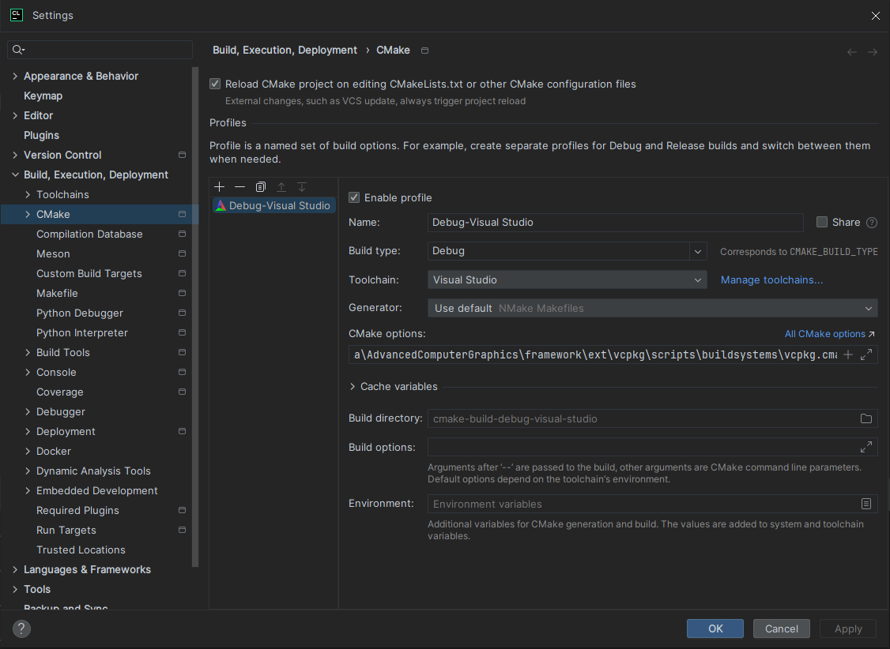

# Advanced Computer Graphics

Project opened using CLion. Installation steps:

1. Clone vcpkg with command in `framework/ext/install.txt`
2. In CLion CMake settings, specify toolchain file. The path is from school computer.

```bash
-DCMAKE_TOOLCHAIN_FILE=C:\temp\PA213\framework\ext\vcpkg\scripts\buildsystems\vcpkg.cmake
```

3. Make sure you are using `Visual Studio` as the CMake toolchain. The project expects it, MinGW doesn't work.


